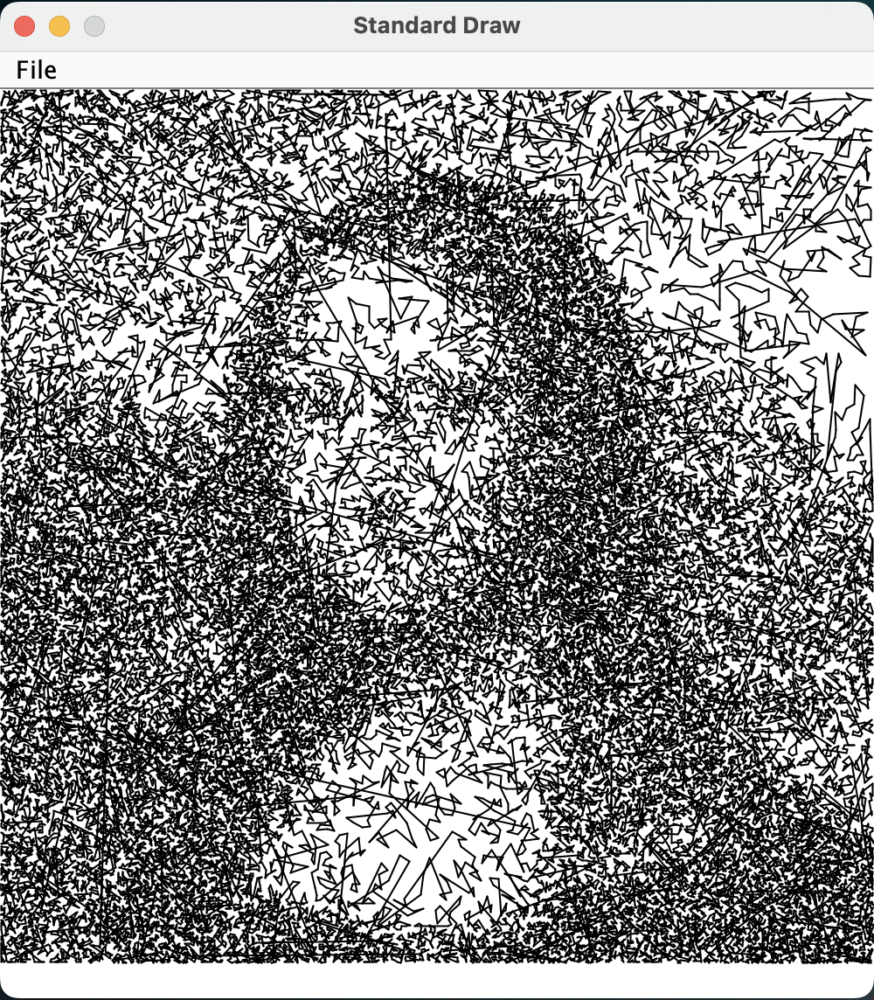

# Traveling-Salesperson-Problem-TSP
A branch and bound solution to the travelling salesman problem. To find the best path, the program traverses a tree that it creates as it goes. It uses a lower bound cost algorithm to prune paths who couldn't possibly be lower than the current best path. To initialize the best cost, a greedy solution is found.

tsp-mona-100k-SmallestInsertion

